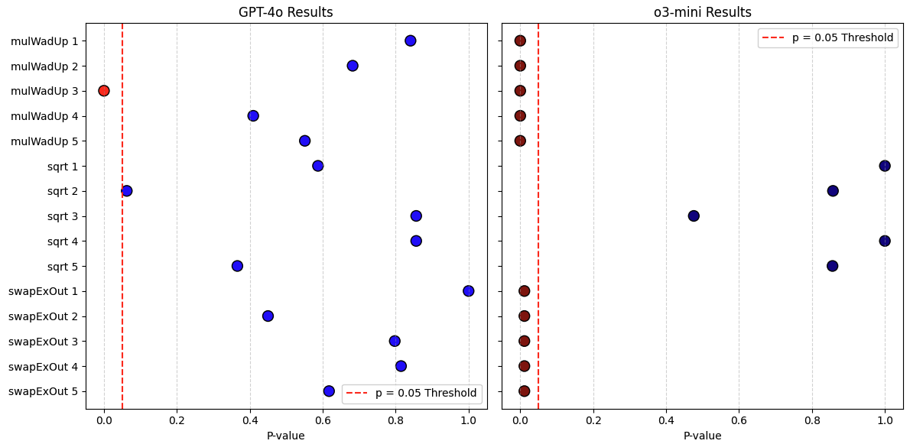
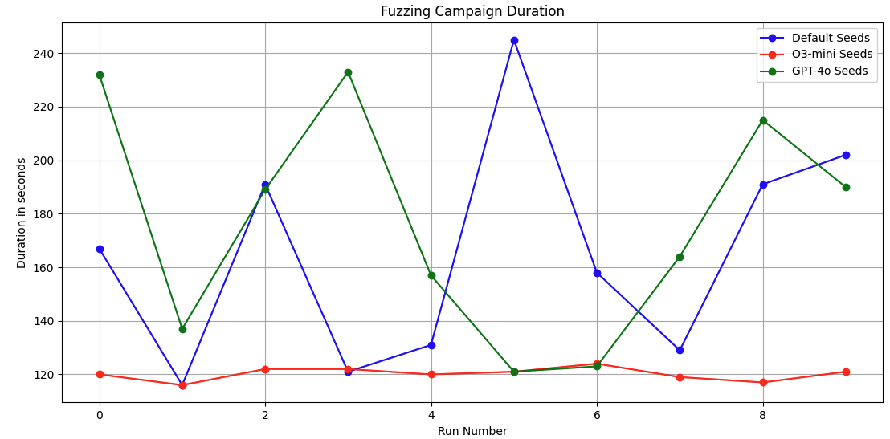

<h3 align="center">Leveraging LLM-generated Seeds for Mutation-based Fuzzing in Solidity Smart Contracts</h3>

<p align="center">
  

  
  
</p>

# About The Project

## Project Description

Welcome to **"Leveraging LLM-generated seeds for mutation-based fuzzing in Solidity smart contracts"** repository.
This project highlights the research results of my bachelor thesis *"Leveraging LLM-Generated Seeds
for Mutation-Based Fuzzing in Solidity"*, in which I've tested the integration of different OpenAI models with [Echidna](https://github.com/crytic/echidna?tab=readme-ov-file) smart contract fuzzer and it's influence on the fuzzing outcome.

Recent research shows that LLMs can be used to enhance the fuzzing process without being directly integrated into the fuzzing engine. In 2023, [Asmita et al.](https://www.usenix.org/conference/usenixsecurity24/presentation/asmita) used LLM to generate a set of initial seeds, called
the seed corpus, for mutation-based fuzzing of embedded Linux firmware. Asmita
et al. claim that the proposed technique significantly improved the fuzzing outcome
by enhancing the number of identified unique crashes. 

The idea was to use the approach proposed in the paper
to generate high-quality initial seeds that accurately reflect the smart contract code,
rather than relying solely on Echidna internal seed generation. The initial assumption was that LLM's ability to understand context can help in generating seeds not only for structural peculiarities of the contract, but also tailored to an exact specific function implementation and protocol logic. 

## Test setup

For the test benchmark I've modified two protocols designed by Cyfrin:
1. A fixed point math library for WAD numbers [MathMasters](https://github.com/Cyfrin/2024-01-math-master/tree/main)
2. An AMM protocol [Tswap](https://github.com/Cyfrin/5-t-swap-audit)

Both contracs have intentionally injected vulnerabilities which I modified and also introduced new ones. It is obvious that smart contract property based testing differs from traditional software fuzzing and the bug can only be uncovered if the test suite and harness are designed properly, so the challenge was to introduce such bugs that can be potentially missed by Echidna even with correct test suites. 


With test limit equal to 100,000 runs Echidna has following bug detection rates for introduced vulnerabilities:

* *AlmostPreciseMath*
    1. mulWadUp - multipliestwoWADnumbersi.e., numberswith
    18 decimal places, rounding up. If the result of dividing y by x is exactly
    one, the output value is rounded incorrectly. Adopted from MathMasters without change
    2. sqrt - computes the square root of xx using Heron’s method.
    One of initial estimate thresholds is slightly inaccurate, leading
    to imprecise calculations for values within a narrow range. Adopted with a threshold change
* *SwapPool*
    1. swapExactOutput - determines the amount of input tokens
    required to obtain a specified amount of output tokens and then executes
    the swap. If the requested output amount approaches the total token
    reserves in the pool, the user may receive slightly fewer tokens due to an
    improperly implemented slippage protection mechanism. Was engineered and injected in TSwap protocol,
    the original TSwap vulnerability that breaks the protocol invariant is fixed 

For each of the two protocols from the benchmark, 250 separate fuzzing campaigns
were executed using seeds automatically generated by Echidna. These campaigns
were conducted to estimate the fuzzing failure rate, allowing a comparison between
the results of the proposed approach and these values. The odds that a bug is
detected by Echidna using default seeds, with a 95% confidence level, are as fol-
lows
* *mulWadUp* - 82 ± 5%
* *sqrt* - 25 ± 5%
* *swapExactOutput* - 90 ± 5%

After that, 50 separate fuzzing campaigns were executed for each generated seed corpus, leading to
a total of 1,000 fuzzing campaigns.

Running 250 campaigns for each generated corpus would be too time-consuming, so
the number of runs was reduced to 50 per corpus. Since the confidence intervals for
fuzzing with default Echidna seeds were determined based on 250 campaigns, directly
comparing the results of fuzzing with LLM-generated seed corpora to these intervals
would be inaccurate. To address this issue, Fisher’s exact test was applied. It
determines whether the difference in fuzzing rates is statistically significant, meaning
whether fuzzing with LLM-generated seeds leads to a different outcome. Compared
to methods like the chi-square test, Fisher’s exact test is more suitable for small
sample sizes and is particularly effective for comparing proportions of success and
failure.

<p align="right">(<a href="#readme-top">back to top</a>)</p>

## Tested approach

I've chosen [Echidna](https://github.com/crytic/echidna) as a property-based coverage guided fuzzer for this project, as it is has comprehencive documentation, supports *corpus replay* and is currently used by most of the top notch auditing companies. The seed generation is implemented as follows:
1. Seeds are generated using python `seed_generator.py` script, which makes requests to OpenAI models using API. The response is saved in a .txt file 
2. Contract ABI is extracted using another python script named `get_abi`
3. Using `wrapper.py` script and contract ABI alongside with generated seed values, the seeds are wrapped in an Echidna compatible format and then added into the corpus directory manually 
4. Fuzzing campaigns are ran with following parameters in config.yaml file:
```
testMode: assertion
corpusDir: "corpusDir"
seqLen: 25
testLimit: 100000
```
 
## Research outcome

Two OpenAI models were tested: [gpt-4o](https://openai.com/index/hello-gpt-4o/) and [o3-mini](https://openai.com/index/openai-o3-mini/). 

Using the proposed prompt *gpt-4o* model doesn to seem to deliver any results that would be statistically different from fuzzing with deafult Echidna seeds. This indicates that the fuzzing process was not affected by the use of
generated seeds. 



However, two seed corpora produced different results. In particular, Corpus 3 con-
tained a seed that directly triggered a bug in the mulWadUp function, causing the
property to be violated in every fuzzing campaign. Upon closer examination, this
seed was found to have been randomly generated as an overflow test case. Despite
its classification, the bug it triggered was unrelated to overflows and could be consid-
ered a coincidental discovery. Corpus 2 has a borderline p-value for the sqrt function,
which could be considered almost significant. However, the average odds of finding
the bug were lower. This suggests that using this corpus of initial seeds may lead to
less effective fuzzing results.
The o3 model, which is more capable in reasoning tasks, demonstrated better results
on the AlmostPreciseMath contract. It identified bug in the mulWadUp function
across all five attempts, provided a correct justification for the nature of the bug,
and generated values that violate the property directly. Although the bug in the
sqrt function was not detected and the difference between rates was not statistically
significant, the suggested values were actually tailored to the specific function imple-
mentation. For example, they targeted an edge case unique to Heron’s method for
computing square roots.
ThebranchintheswapExactOutputfunctionthatviolatedtheprotocolpropertywas
also detected. Unlike GPT-4o, which generated numeric values for that function, o3-
miniwasabletounderstandthatthevaluetriggeringthebugdependsonpoolreserve
parametersdefinedinanexternalcontract, whichcouldbealsoalteredwithinthecall
sequence during the fuzzing process. The model suggested a formula to calculate the
value using the current pool reserves, which produces results that trigger the bug.
After manually calculating the value for the defined pool reserves, wrapping it as
a seed, and adding it to the seed corpus, the property is violated in each distinct
fuzzing campaign.

Moreover, after identifying a call sequence that triggers the bug, Echidna attempts to minimize
the sequence, making it as short and simple as possible. However, for complex pro-
tocols, such as a decentralized exchange, this may result in significant time overhead.
The use of the generated seed corpus helps save time on minimization, as the bug is
always triggered within a single function call:




<p align="right">(<a href="#readme-top">back to top</a>)</p>

## Repository structure

```
├── 1-magic
│   ├── config.yaml                 # Echidna configuration file
│   ├── magic.sol                   # Contract for initial tests
├── 2-math
│   ├── AlmostPreciseMath.sol       # Fixed point math contract
│   └── config.yaml                 # Echidna configuration file
├── 3-amm
│   ├── src
|   |    ├── PoolFactory            # Creates a pool for a token pair
│   |    └── SwapPool.sol           # Main AMM protocol engine
|   ├── test
|   |     └── mocks
|   |           └── ERC20Moc.sol    # Mock ERC20 contract that mimics token behavior
|   ├── config.yaml                 # Echidna configuration file
|   ├── Setup.sol                   # Sets up the test environment
|   └── EchidnaTestAMM.sol          # Test contract where all properties are defined      
├── python-scripts
│   ├── plots
|   |     ├── confintervals.py      # Plots confidence intervals 
|   |     ├── fisherstest.py        # Calculates p-values and odd ratios for fisher's test
|   |     ├── fisherstestplot.py    # Plots the results of fisher's test
|   |     └── timeoverhead.py       # Plots the time series of fuzzing duration
│   ├── get_abi.py                  # Extracts contract's ABI
│   ├── seed_generator.py           # Calls listed model
|   └── wrapper.sol                 # Wraps values into the right seed format
├── requirements.txt                # Dependencies
└──README.md                        # Project documentation
```

<p align="right">(<a href="#readme-top">back to top</a>)</p>


<!-- GETTING STARTED -->
# Getting Started

## Prerequisites

- Python 3.8+
- Node.js (for Solidity tools like `solc`)
- API access to an LLM service (e.g., OpenAI API key)
- [Foundry](https://book.getfoundry.sh)
- [Echidna](https://github.com/crytic/echidna)


## Setup

1. Clone the repo
2. Run following commands:
```bash
 cd 3-amm
 forge install foundry-rs/forge-std --no-commit
 forge install openzeppelin/openzeppelin-contracts --no-commit
```
```bash
 pip install openai
 pip install matplotlib
 pip install numpy
 pip install scipy
```
3. [Create an API key](https://platform.openai.com/docs/overview) for OpenAI
4. Add your OpenAI API key to the seed_generator.py:
     ```py
     client = OpenAI(
        api_key="API_KEY_HERE"
     )
     ```

## Usage 

### 1. Generate values
1. Add seed_generator.py into the project folder
2. cd into the folder
3. Run:
```bash
python seed_generator.py '<input_files>' <output_file>
```

### 2. Wrap the values into the seed format
1. cd into the project folder
2. Important: this must be a foundry project, as the script uses `forge inspect` command. If the foundry project is not set up, run `forge init` and add contracts in scope into the /src folder
3. Copy get_abi.py and wrapper.py into the folder
4. Run get_abi.py to extract the ABI
5. Using the extracted ABI and generated values, run wrapper.py
6. wrapper.py usage example:
```bash
python wrapper.py --abi AlmostPreciseMath.abi.json --functions '["solmateSqrt", "test_fuzzDivWadUp"]' --values '[
[123456], [10,20]]' --outfile seeds.txt
```

### 2. Start Fuzzing
Run Echidna:
```bash
echidna CONTRACT_NAME --config config.yaml
```


<p align="right">(<a href="#readme-top">back to top</a>)</p>

# Known Issues

1. `get_abi.py` uses `forge inspect` command, thus works only in the foundry projects
2. `wrapper.py` must be modified in order to work with payable functions or adjustable delay and gas price
3. Test protocols set up within the allotted time demonstrated the benefits of using LLM-generated initial seed corpora. However, due to the small size of
thebenchmark,theseresultsshouldbeinterpretedwithcaution.


<p align="right">(<a href="#readme-top">back to top</a>)</p>
